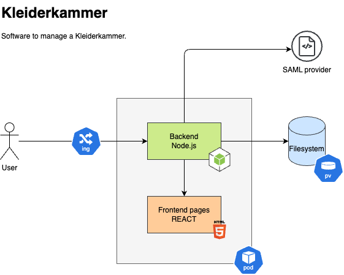

# Kleiderkammer
Simple clothing management (Kleiderkammer) software for i.e. a youth fire brigades (Jugendfeuerwehr).

## Architecture


## Development

The project consists of two main components:

- `backend/`: Node.js + TypeScript (Express) Server
  - Serves static frontend files from `backend/public`
  - REST API under `/api/*`
- `frontend/`: React + Vite + TypeScript App
  - Builds to `backend/public`
  - Dev mode: automatic rebuild on changes

### Initial Setup

1. Install backend dependencies:
```bash
cd backend
npm install
```

2. Install frontend dependencies:
```bash
cd ../frontend
npm install
```

### Start Development Server

Run in the `backend` directory:

```bash
cd backend  # if not already in backend/
npm run dev
```

This starts:
- Backend server on http://localhost:3000 (with hot-reload)
- Frontend build in watch mode (rebuilds to `backend/public` on changes)

### Debugging

#### Backend Debugging
1. Open VS Code Debug tab
2. Select "Attach to Backend"
3. Press F5 to start debugging

Note: Backend server must be running with `npm run dev`.

#### Frontend Debugging
1. Open Chrome DevTools (F12)
2. Source maps are automatically enabled
3. Set breakpoints in `.tsx`/`.ts` files


## SAML Authentication with Authentik

The backend uses SAML authentication via Authentik. Here's how to set it up:

### 1. Generate SP Certificate and Key

```bash
# In backend/config directory
openssl genrsa -out sp-private-key.pem 2048
openssl req -new -x509 -key sp-private-key.pem -out sp-certificate.pem -days 365
```

### 2. Configure Authentik Provider

1. In Authentik admin interface:
   - Go to "Applications" → "Providers"
   - Click "Create" → "SAML Provider"
   - Fill in:
     - Name: "Kleiderkammer"
     - ACS URL: "http://localhost:3000/saml/callback"
     - Audience: "http://localhost:3000/saml/metadata"
     - Issuer: "https://auth.example.com/application/saml/kleiderkammer/"
     - Service Provider Binding: "Post"
     - Advanced → Assertion Valid Not Before: "-5"

2. Create an Application:
   - Go to "Applications" → "Applications"
   - Click "Create"
   - Fill in:
     - Name: "Kleiderkammer"
     - Slug: "kleiderkammer"
     - Provider: Select the SAML provider you created
   - Save and note the application slug

3. Download Authentik Certificate:
   - Go to "Applications" → "Providers"
   - Click on your SAML provider
   - Click "Download certificate"
   - Save as `authentik-certificate.pem` in `backend/config`

### 3. Update SAML Configuration

Edit `backend/config/saml-config.yaml`:

```yaml
saml:
  sp:
    entityId: "http://localhost:3000/saml/metadata"
    assertionConsumerService: "http://localhost:3000/saml/callback"
    privateKey: "/absolute/path/to/backend/config/sp-private-key.pem"
    certificate: "/absolute/path/to/backend/config/sp-certificate.pem"
  idp:
    entityId: "https://auth.example.com/application/saml/kleiderkammer/"
    ssoUrl: "https://auth.example.com/application/saml/kleiderkammer/sso/binding/redirect/"
    certificate: "/absolute/path/to/backend/config/authentik-certificate.pem"

session:
  secret: "generate-a-secure-random-string"  # Change this!
  cookie:
    secure: true
    sameSite: "lax"

server:
  baseUrl: "http://localhost:3000"
  behindProxy: false
```

Replace:
- `auth.example.com` with your Authentik domain
- Update certificate paths to absolute paths
- Generate a secure session secret

### 4. Test SAML Setup

1. Start the backend: `cd backend && npm run dev`
2. Visit http://localhost:3000/saml/metadata
   - Should show SAML metadata XML
3. Visit http://localhost:3000/api/health
   - Should redirect to Authentik login
   - After login, should show `{"status":"ok"}`

### API Test Endpoints

- Backend Health: http://localhost:3000/api/health
  ```bash
  curl http://localhost:3000/api/health
  # Expected: {"status":"ok"}
  ```
